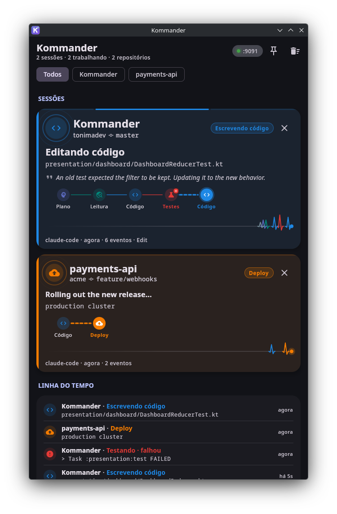
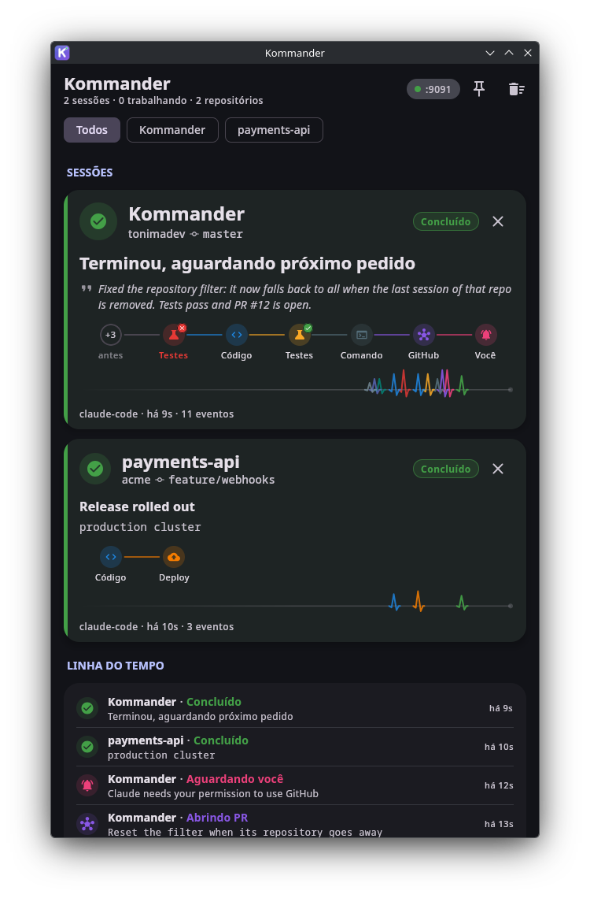

# Kommander

A **Compose Desktop** companion dashboard that shows, in real time, **what Claude Code is doing and in which
repository**: reading code, editing, running tests, opening pull requests, deploying, waiting for your answer…

```
Claude Code ──hook (stdin JSON)──► curl ──POST──► Ktor (127.0.0.1:8080) ──SharedFlow──► ViewModel (StateFlow) ──► Compose UI
Your script ──────────────────────────────POST /events──┘
```

<p align="center">
  
  
</p>

<p align="center"><sub>Left: Claude fixing the code after the tests failed, with the reason in the timeline.
Right: the finished request, with the flow it actually took and Claude's final answer. Generated with <code>./scripts/simulate.sh</code>.</sub></p>

- **One card per session** with repository, branch and current status, with an icon and color per category.
- **Pulsing icon**: radar rings while Claude works; a faster pink pulse when it **needs you**.
- **Request flow**: a rail built from the steps Claude actually took, in the order they happened
  (e.g. `Plan → Read → Code → Tests ✗ → Code → Tests ✓ → GitHub`). Consecutive actions of the same kind merge into
  one step with a counter, the current step pulses, and older steps collapse into `+N`.
- **Outcome of every action** (`PostToolUse`/`PostToolUseFailure`): failures turn red on the card, the rail, the pulse
  line and the timeline, with the reason (e.g. `24 tests completed, 1 failed`). Tests and deploys that pass get a ✓.
- **What Claude is saying**: its latest sentence between tools, read from the session transcript, shows up as a quote
  on the card; when it finishes, the card shows its final answer.
- **Pulse line** (ECG style): every action is a colored spike that slides across the last 90 seconds, with a pulsing
  head while there is work in progress.
- The border lights up on every new event, and an indeterminate progress bar runs on top of cards that are working.
- **Timeline** of everything that happened, filterable by repository.
- Animations only run while something is happening: with Claude idle, the app is idle too.
- **Always on top** toggle to keep the companion visible.

> The app UI is currently in Portuguese.

## Running

Requires JDK 17+.

```bash
git clone https://github.com/tonimadev/Kommander.git
cd Kommander

./gradlew :desktopApp:run                       # default port 8080
./gradlew :desktopApp:run --args="--port=9090"  # or KOMMANDER_PORT=9090
```

In another terminal, watch the dashboard react to two simulated sessions:

```bash
./scripts/simulate.sh
```

### Install on Linux (native executable + application menu entry)

```bash
./scripts/install-linux.sh              # build and install, or update an existing install
./scripts/install-linux.sh --uninstall  # remove it
```

The script builds the native executable with a bundled JVM (no Java needed to run it) and installs it for the
current user, without root, into `~/.local` (override with `PREFIX=...`):

| What                        | Where                                              |
|-----------------------------|----------------------------------------------------|
| App and bundled runtime     | `~/.local/opt/kommander/`                          |
| Launcher                    | `~/.local/bin/kommander`                           |
| Icon                        | `~/.local/share/icons/hicolor/{scalable,256x256}/apps/` |
| Application menu entry      | `~/.local/share/applications/kommander.desktop`    |

The window identifies itself as `kommander` (`StartupWMClass`), so the taskbar shows it under the app's icon.
To only build the executable: `./gradlew :desktopApp:createDistributable`
(output in `desktopApp/build/compose/binaries/main/app/kommander/`).

Installable packages: `./gradlew :desktopApp:packageDeb` / `packageRpm`.

## Connecting Claude Code

Claude Code runs [hooks](https://docs.claude.com/en/docs/claude-code/hooks) at every step and passes a JSON payload on
stdin (`session_id`, `cwd`, `tool_name`, `tool_input`, `tool_use_id`, `transcript_path`…). Each hook just forwards that
JSON with `curl` to `POST /hooks/claude-code`; Kommander interprets the event and finds the repository by reading the
`.git` of the `cwd`.

```bash
./integrations/claude-code/install-hooks.sh   # merges into ~/.claude/settings.json (with a backup, requires jq)
```

Or copy [`integrations/claude-code/hooks.json`](integrations/claude-code/hooks.json) into a user or project
`settings.json`. The hooks use `--max-time 1` and `|| true`: if Kommander is closed, Claude Code carries on as usual.
The `curl` output goes to `/dev/null` so it is not injected into Claude's context (on `UserPromptSubmit` and
`SessionStart`, hook stdout becomes context).

| Claude Code hook                                      | Dashboard status             |
|-------------------------------------------------------|------------------------------|
| `SessionStart`                                        | Session started              |
| `UserPromptSubmit`                                    | Thinking (shows the prompt)  |
| `PreToolUse` Read / Grep / Glob / WebFetch / ToolSearch | Exploring                  |
| `PreToolUse` Edit / Write / MultiEdit                 | Coding (shows the file)      |
| `PreToolUse` Task / Agent / TodoWrite / Skill / SendMessage | Planning               |
| `PreToolUse` AskUserQuestion / ExitPlanMode           | Waiting for you (shows the question) |
| `PreToolUse` Bash `gradle test`, `npm test`, `pytest`…| Testing                      |
| `PreToolUse` Bash `ktlint`, `eslint`, `tsc`, `gradle lint`… | Testing (lint)         |
| `PreToolUse` Bash `npm install`, `pip install`…       | Building (dependencies)      |
| `PreToolUse` Bash `gradle build`, `docker build`…     | Building                     |
| `PreToolUse` Bash `git commit` / `git push`           | Commit / push                |
| `PreToolUse` Bash `git status/diff/log`, `ls`, `cat`, `grep`, `curl`… | Exploring    |
| `PreToolUse` Bash `adb install` / other `adb` commands | Deploying to device / Exploring |
| `PreToolUse` Bash `gh pr create`, `mcp__github__*`    | GitHub (PR, issue, review…)  |
| `PreToolUse` Bash `kubectl apply`, `helm`, `terraform apply`, `docker push`… | Deploying |
| `PreToolUse` other `mcp__<server>__<action>`          | By the action verb: `search/get/list…` → Exploring, `*test*`/`run_task` → Testing, `deploy` → Deploying, anything else → Command (with the server name) |
| `PostToolUse` / `PostToolUseFailure`                  | Completes the original action (matched by `tool_use_id`) with ✓ or ✗ and the reason |
| `Notification`                                        | Waiting for you              |
| `Stop`                                                | Done (with Claude's final answer) |
| `SessionEnd`                                          | Session ended                |

A failing test shows up even when the command exits with 0: for tests, builds and deploys, Kommander scans the output
for signs such as `BUILD FAILED`, `FAILED` or `N failed` (from 1 up). What Claude is saying comes from
`transcript_path`: Kommander reads only the end of the JSONL file (256 KB) and stops at your latest prompt, so text
from a previous request is never shown.

> Installed the hooks before? Run `install-hooks.sh` again to add `PostToolUse` and `PostToolUseFailure`. Without
> them the dashboard still works, just without ✓/✗.

> **Cloud sessions (claude.ai/code):** hooks run in the remote container, where `127.0.0.1` is not your machine.
> For those, expose Kommander through a tunnel and set `KOMMANDER_URL` in the session environment. Only do this with
> authentication on the tunnel: the endpoint itself has none.

## Generic webhook (`POST /events`)

For your own automation scripts (or any other agent):

```bash
curl -X POST localhost:8080/events -H 'Content-Type: application/json' -d '{
  "timestamp": "2026-09-30T12:00:00Z",
  "agent": "claude-code",
  "status": "DEPLOYING",
  "target": "production cluster",
  "message": "Rolling out the new release...",
  "repository": "acme/payments-api",
  "branch": "main",
  "session_id": "deploy-42"
}'
```

Only `status` is required. `repository`/`branch` can be omitted if you send `cwd` (the repository is resolved from its
`.git`). `timestamp` accepts ISO-8601 (with `Z` or an offset) or epoch milliseconds. Accepted statuses
(case-insensitive): `THINKING, PLANNING, EXPLORING, CODING, RUNNING_COMMAND, TESTING, GITHUB, COMMITTING, OPENING_ISSUE,
OPENING_PR, REVIEWING, BUILDING, DEPLOYING, WAITING_INPUT, DONE, SUCCESS, FAILED, ERROR, SESSION_STARTED, SESSION_ENDED,
IDLE`.

Responses: `202 {"accepted":true,"id":N}`, `400` for invalid JSON or a missing `status`. `GET /health` → `200`.

## Architecture

Clean Architecture in 4 Gradle modules; the dependency rule is enforced by the compiler:

```
desktopApp ──► presentation ──► domain ◄── data
     └───────────────(only in AppContainer)────┘
```

| Module         | Contents                                                                                           | Depends on                     |
|----------------|----------------------------------------------------------------------------------------------------|--------------------------------|
| `domain`       | `AgentActivity`, `RepositoryRef`, `ActivityStatus`/`ActivityCategory`, `ToolOutcome`, the `ActivityRepository` port, use cases | coroutines                     |
| `data`         | Ktor embedded server (CIO), DTOs, Claude hook classifier, transcript reader, git repository resolver, `WebhookActivityRepository` (`MutableSharedFlow` + `MutableStateFlow`) | domain, Ktor                   |
| `presentation` | MVI: `DashboardState`, `DashboardIntent`, `DashboardReducer` (pure function), request flow, `DashboardViewModel` (`StateFlow`) | domain (plain Kotlin, no Compose) |
| `desktopApp`   | `main`, composition root (`di/AppContainer`), M3 theme and `@Composable`s                          | presentation, data (DI only)   |

Unidirectional flow: **UI → `DashboardIntent` → ViewModel → `DashboardMutation` → `DashboardReducer` → `StateFlow<DashboardState>` → UI**.
Events from the data layer enter the same reducer as mutations.

The server listens on `127.0.0.1` by default (local processes only). Use `--host=0.0.0.0` only if you know what you
are doing.

## Tests

```bash
./gradlew test
```

They cover the Ktor routes (`testApplication`), the real server over HTTP (including a busy port), classification of
hooks, Bash commands and MCP tools, failure detection in tool results, transcript reading, repository/branch/worktree
resolution from `.git`, the dynamic request flow, the reducer and the ViewModel.
